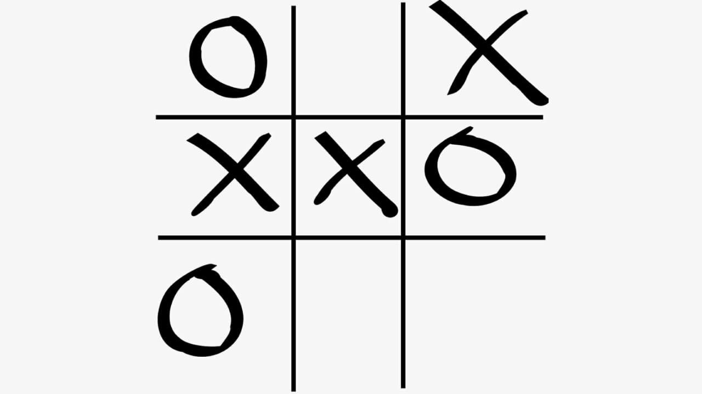

## **Jogo da Velha**:

Tentei fazer um Jogo da Velha em C#, em qu você escolhe qualquer lugar do tabuleiro e ele bota um "X" ou "O". O primeiro a formar 3 casas seguidas na Vertical, Horizontal ou Diagonal vence.

!!! Repositório
    [*Código Jogo da Velha*](https://github.com/FelipeBStefens/Tic-Tac-Toe)

