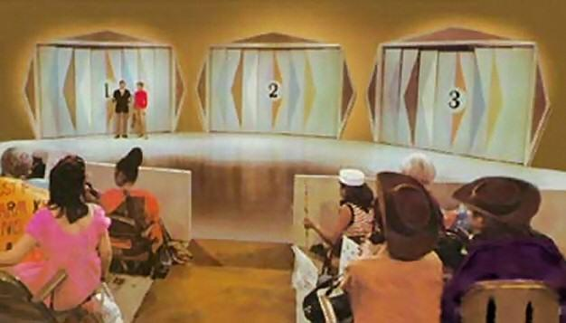

## **Paradoxo de Monty Hall**:

Tentei aplicar um Paradoxo do Monty Hall, onde diz que dentre 3 portas, uma possui um prêmio e as outras duas possui cabras, ao escolher uma das portas, uma outra que sempre possui cabras é aberta, e então você possui a possibilidade de alterar qual das duas portas restantes escolher. Ele diz que é mais provável o prêmio sempre estar na outra porta do jogo.

Chamado assim por ser um apresentador de um programa de 1970 nos Estados Unidos chamado de "Let's Make a Deal".

!!! Repositório
    [*Código do Monty Hall*](https://github.com/FelipeBStefens/Monty-Hall)

